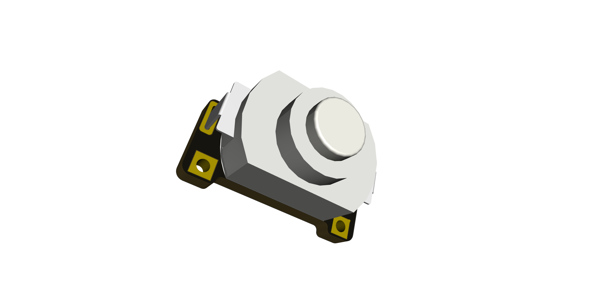

# KAN15 Breakout

A basic breadboard-friendly breakout board for the KAN-15 push-button switch. It has a cavity in the center for an optional LED and resistor. To see a fully self-contained LED stackup, look at the [LED Stack board](../LED-Stack)

