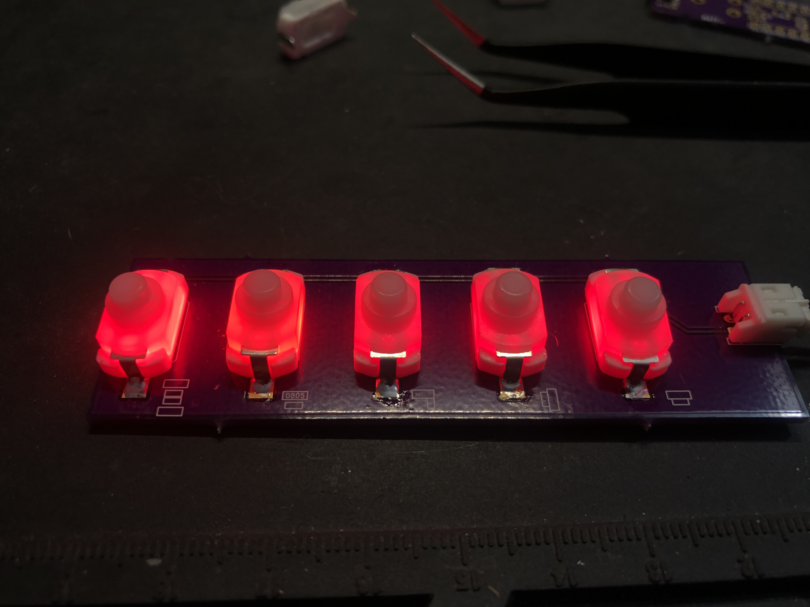
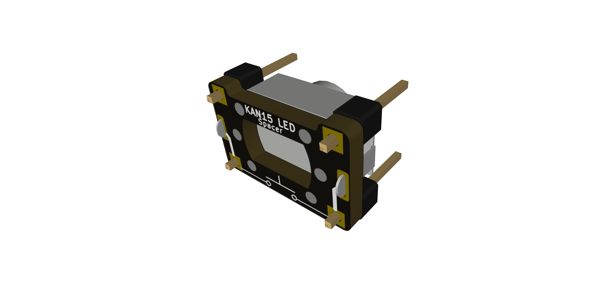
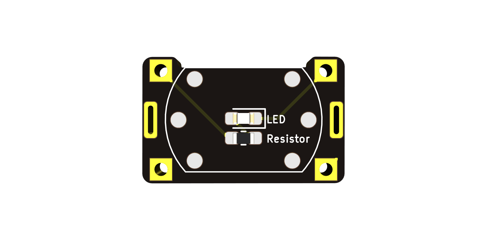

# KAN15 LEDs Stack Breakout

This stack creates a self-contained, breadboard friendly, breakout board with LED. The LED will shine through the white KAN15 switch and light it up pretty well.

# PCB Stackup

It starts with a PCB layer as thin as 0.8mm with a hole cut in the middle. This is the "spacer" layer and creates a cavity for the LED and resister.

The bottom layer has the LED and resistor and should be placed below the spacer layer. You'll see some circular pads that can be used to connect the layers with solder. This layer can be made of flex PCB, to keep it really thin.

