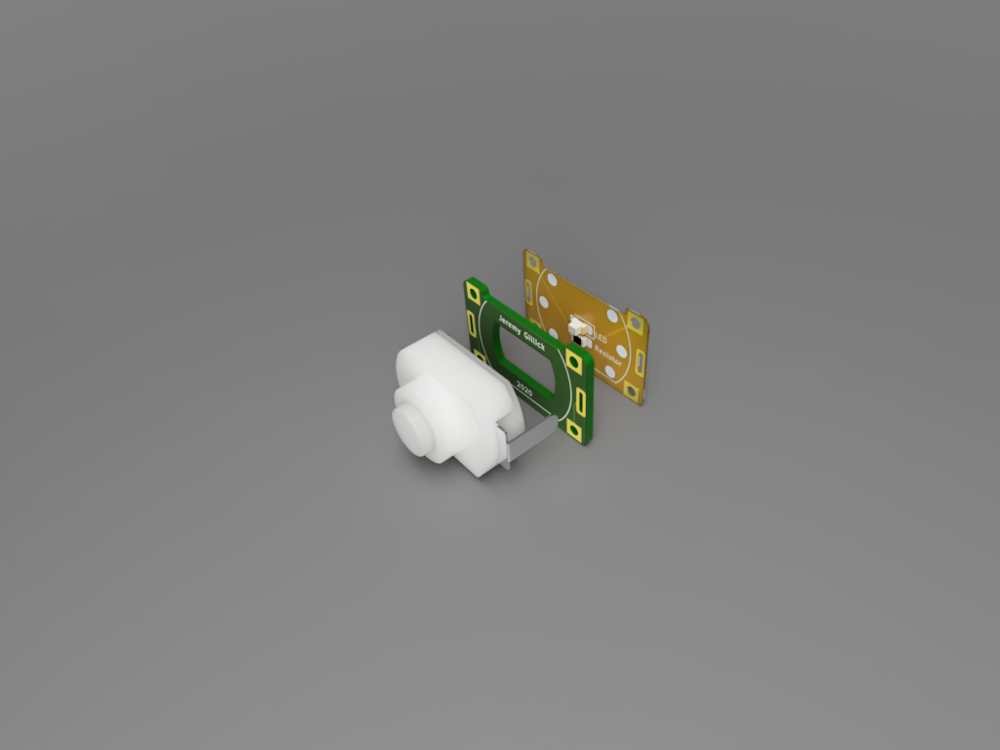

# KAN15 LEDs Stack Breakout

This stack creates a self-contained, breadboard friendly, breakout board with LED. The LED will shine through the white KAN15 switch and light it up pretty well.

# PCB Stackup

* 0.8 PCB spacer
* Flex PCB bottom (for LED & resistor)

The top PCB layer is the "spacer" creates a cavity for the LED and resistor. This should be around 0.8mm thick (or at least a little thicker than the resistor you're using).

The bottom layer has the LED and resistor and can be a thin flex PCB.

To assist with lining the layers up and holding them together, there are matching solder pads on the sides of the PCB/Flex which connect (perhaps unnecessary).

