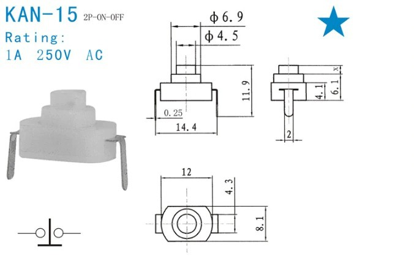
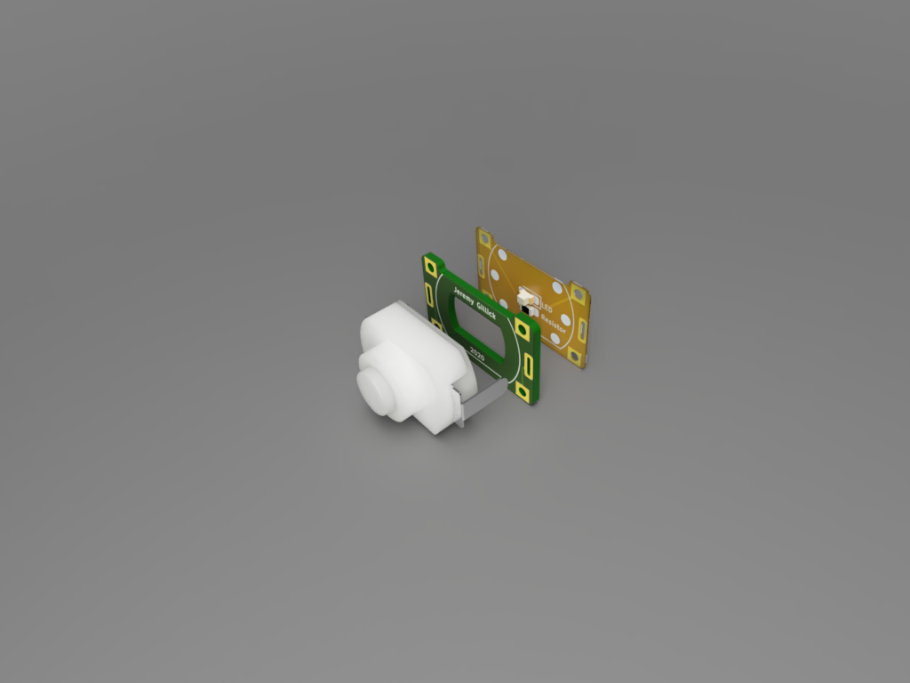

# KAN-15 Switch Breakout Boards

A collection of useful PCB boards designed in KiCad for the KAN-15 push-button switch.

# LED Illumination
The best part about these switches is that they can easily be illuminated with an LED.

To do this, you need to add a spacer between the LED and the swtich. This can be a PCB spacer, or [3D printed](https://www.thingiverse.com/thing:4592896).

# Boards

* [Spacer](./Spacer) - This is just the spacer PCB. (not breadboard friendly)
* [Breakout](./Breakout) - A simple breadboard-friendly board for the swtich. It has a cavity for an LED, but no connections for one.
* [LED Stack](./LED-Stack/) - A novel 2-PCB stackup to create a thin, self-contained, LED switch.
* [RGB Stack](./RGB-Stack) - Similar to LED Stack but uses an RGB LED.

# KiCad Footprint
If you want the base KAN-15 KiCad footprint these breakout boards are based on, it is located in my general [KiCad Library](https://github.com/jgillick/KiCad-library).