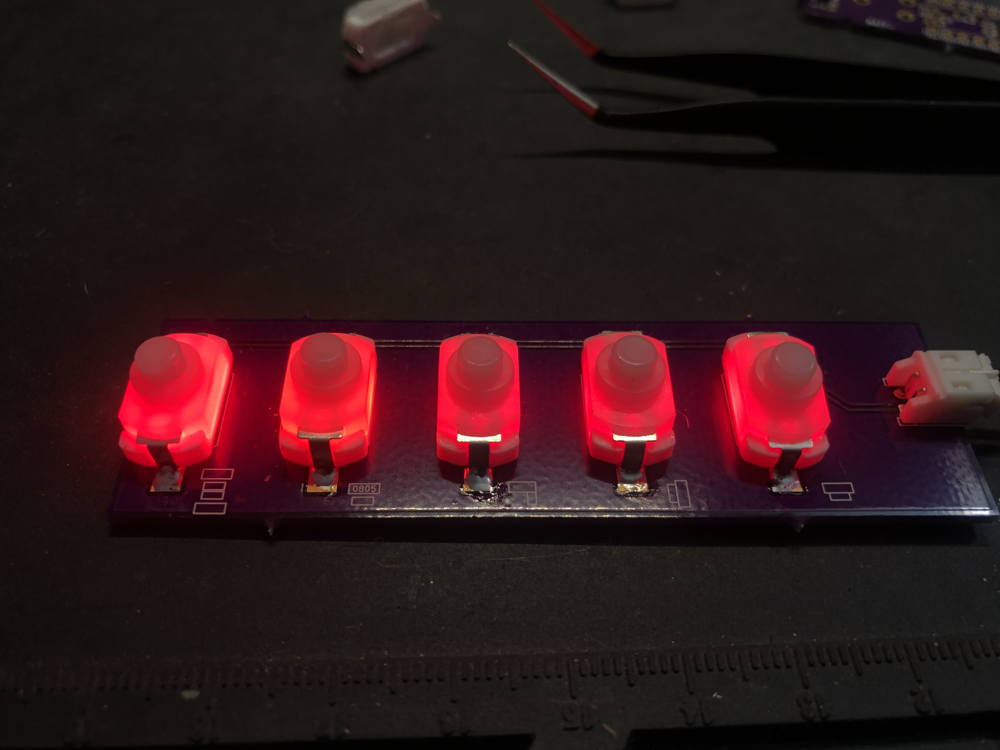

# KAN-15 Switch Breakout Boards

A collection of useful breakout boards designed in KiCad for the KAN-15 push-button switch.

# LED Illumination
The best part about these switches is that they can easily be illuminated.

To light up the switch, you need to put an LED under it using a simple stack of PCBs. See [LED Stack](./LED-Stack) for more information.

# KiCad Footprint
If you want the base KAN-15 KiCad footprint these breakout boards are based on, it is located in my general [KiCad Library](https://github.com/jgillick/KiCad-library).