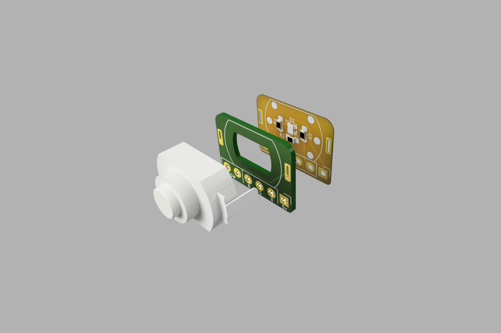
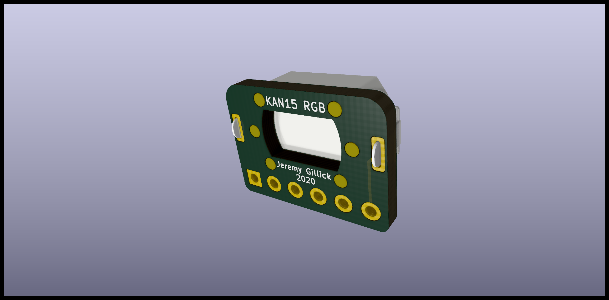
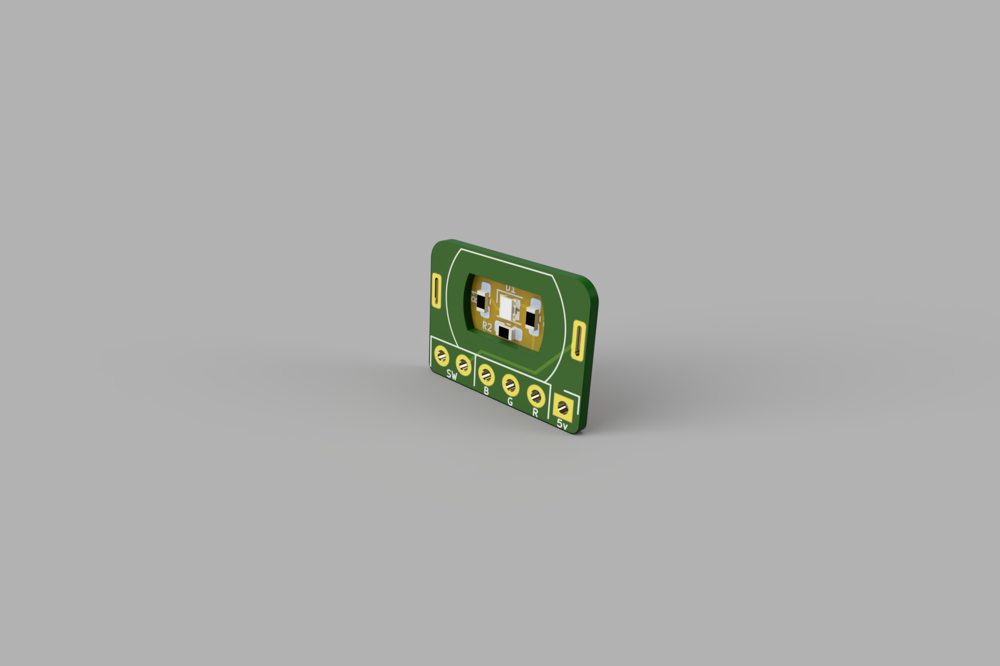
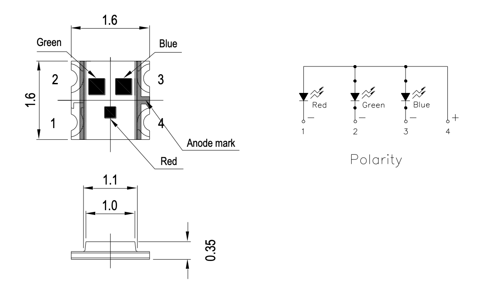

# KAN15 RGB Stack Breakout

This stack creates a self-contained, breadboard friendly, breakout board with an RGB LED embedded under the switch. The LED will shine through the white KAN15 switch and light it up pretty well.

# PCB Stackup

* 0.8 PCB spacer
* Flex PCB bottom (for LED & resistor)

The top PCB layer is the "spacer" creates a cavity for the [LED](https://www.digikey.com/en/products/detail/everlight-electronics-co-ltd/EAST1616RGBB2/8510360) and resistors. This should be around 0.8mm thick (or at least a little thicker than the resistor you're using).

The bottom layer has the LED and resistor and can be a thin flex PCB.

To assist with lining the layers up and holding them together, there are matching solder pads on the sides of the PCB/Flex which connect (perhaps unnecessary).

# RGB LED

The LED used for this board is a `0606 4-SMD` SMD LED (1.60mm L x 1.60mm W) with the anode on pin 4. The LED I used was [EAST1616RGBB2](https://www.digikey.com/en/products/detail/everlight-electronics-co-ltd/EAST1616RGBB2/8510360).

If you use another LED, make sure it's in a 4-pin 1.6mm square package, and matches this pin layout.

