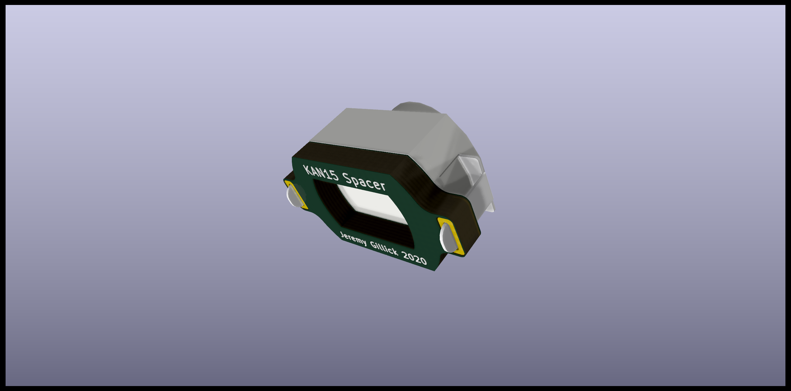

# KAN15 Spacer

A PCB spacer with a cavity to place LEDs under the KAN15 switch. The footprint is identical to the [KAN15 footprint](https://github.com/jgillick/KiCad-library/blob/master/footprints/Button_Switch.pretty/SW_KAN-15_PHT.kicad_mod) and ideal for custom made PCBs. If you want something breadboard friendly, look at the [Breakout](../Breakout/) version.

